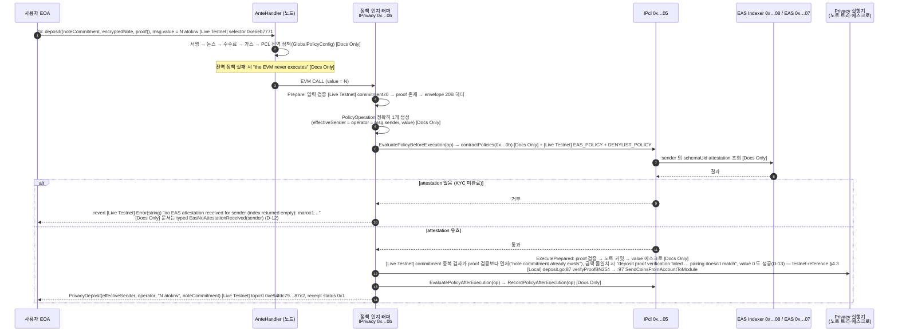

# 아키텍처 — OKRW → PCL → Privacy 한 호출의 흐름, 신뢰 경계, FAQ

이 문서는 워크숍 Step 3(`IPrivacy.deposit`)에서 **한 트랜잭션 안에서 세 primitive 가 어떻게 이어지는지**를 그림과 표로 설명한다. 주소·selector·오류 문자열의 정본은 [`testnet-reference.md`](testnet-reference.md) 이고, 여기서는 그 값을 인용만 한다.

- 출처 규칙: 문장 단위로 docs.maroo.io (2026-09-02 WebFetch, `/en/`) 를 인용하면 `[Docs Only]`, 테스트넷 읽기 전용 호출로 확인한 것은 `[Live Testnet]`, Clairveil HEAD `ca85b02` 의 파일:라인은 `[Local]`. Clairveil 은 **기반 프라이버시 모듈의 구현 참고 자료**일 뿐이고 Maroo 의 외부 인터페이스는 docs 가 정본이다(과제 L135-140).
- 라벨은 과제 L158 의 네 가지만 쓴다.
- 약어: **가이드** = `../../maroo-exploration-guide.md`, **리뷰** = `../../review-skeleton-and-track2.md`, **Clairveil** = `../../clairveil/` (`git rev-parse HEAD` = `ca85b02708fdd75259d4d2ee2d671c21198cec69`, origin `https://github.com/DELIGHT-LABS/clairveil.git`, Apache-2.0 + NOTICE).

---

## 1. 한 호출 흐름: `IPrivacy.deposit` 이 OKRW·PCL·Privacy 를 잇는다

### 1.1 왜 이 호출인가

- 과제가 요구하는 "OKRW, PCL, Privacy 가 연결되는 흐름"(과제 L339)을 **한 tx** 로 만드는 문서상 유일한 경로다(가이드 §1 REQ-FLOW).
- OKRW 는 `msg.value` 로 들어간다: "The deposit amount is derived from `msg.value` under the runtime native denom" (docs `concepts/privacy/privacy-precompile-overview`) `[Docs Only]`. 실측 denom 은 `atokrw` (D-1) `[Live Testnet]`.
- PCL 은 프리컴파일을 감싼 래퍼가 부른다: "The chain wraps the executor in a policy-aware precompile that owns the native-action snapshot and drives the full PCL contract-policy lifecycle for every mutating call." (docs `concepts/privacy/privacy-policy-aware-precompile`) `[Docs Only]`.
- `0x…0b` 에는 이미 정책이 걸려 있다: `contractPolicies(0x…0b)` = `EAS_POLICY`(schemaUid `0x3e448d93…527d`) + `DENYLIST_POLICY`(빈 목록), admin = `policyAdmin` (`testnet-reference.md` §6.2) `[Live Testnet]`.

### 1.2 시퀀스 다이어그램

라벨 규칙: 화살표 뒤 `[Docs Only]` = docs 문장, `[Live Testnet]` = 2026-09-02 07:5x UTC(및 08:2x UTC 재실측) `eth_call` 재생·receipt 로 확인, `[Local]` = Clairveil 구현 참고(Maroo 바이너리가 같다는 근거는 없음).

문장 근거(전부 2026-09-02 WebFetch 원문):

| 단계 | 인용 | 페이지 | 라벨 |
|---|---|---|---|
| 2 | "Signature verification … Nonce check … Fee deduction … Gas limit validation … PCL evaluation: every active GlobalPolicyConfig PolicySet is evaluated against the tx (denylists, KYC, volume, period)." | `concepts/network/maroo-transaction-lifecycle` | `[Docs Only]` |
| 2 | "Any single failure aborts the transaction with the corresponding ReasonCode; the EVM never executes." / "only global is evaluated for other calls" | `concepts/compliance/pcl-policy-enforcement` | `[Docs Only]` |
| 5 | 입력 검증 문자열 3종과 순서 | `testnet-reference.md` §4.3 | `[Live Testnet]` |
| 6 | "Each call must produce exactly one contract-scoped `PolicyOperation` describing the effective sender, recipient, asset, and value." / "Deposits require the operator (`msg.sender`) to be the effective sender" | `privacy-policy-aware-precompile`, `privacy-precompile-overview` | `[Docs Only]` |
| 6–11 | "Prepare … EvaluatePolicyBeforeExecution(op) … ExecutePrepared(...) … EvaluatePolicyAfterExecution(op) … RecordPolicyAfterExecution(op)" | `privacy-policy-aware-precompile` | `[Docs Only]` |
| 7 | `contractPolicies(0x…0b)` 응답, `pclProxy(0x…0b)` = 0 (프록시가 아니라 래퍼 경로) | `testnet-reference.md` §6.2 | `[Live Testnet]` |
| 8 | "Looks up attestations issued to `sender` under `schemaUid` via the EAS Indexer" / 실패 순서 `EasNoAttestationReceived → EasAttestationRevoked → EasAttestationExpired → EasAttestationLookupFailed → EasAttestationRequired` / "Once a fresh attestation lands on-chain, the same transaction succeeds." | `concepts/compliance/pcl-template-eas-policy` | `[Docs Only]` |
| 10 | "Anything PCL rejects surfaces as a typed PCL ReasonCode ABI-encoded into the revert data" / "Non-PCL failures (invalid proof, spent nullifier, insufficient tree capacity) surface as plain string reverts from the executor." vs 실측: PCL(EAS_POLICY) 거부도 `Error(string)` 으로 옴 — 불일치는 EAS 거부의 revert 형태에 한정되며, proof·중복 오류가 string 인 것은 docs 와 일치 | `privacy-policy-aware-precompile`; `testnet-reference.md` §6.4 | `[Docs Only]` vs `[Live Testnet]` (D-12) |
| 12 | Clairveil `x/privacy/keeper/deposit.go:87` `verifyProofBN254(...)` 뒤 `:97` `SendCoinsFromAccountToModule` — 증명 먼저, 잠금 나중 (가이드 §5.4-② 는 `docs/clairveil-circuits.md:L74` 가 반대로 씀) | Clairveil | `[Local]` |
| 14 | receipt `logs[0]` topic0 = `keccak("PrivacyDeposit(address,address,string,bytes)")`, `amount` = `"10000000000000000000atokrw"` | `testnet-reference.md` §5 | `[Live Testnet]` |

### 1.3 이 그림에서 자주 틀리는 것

- `runOnPcl` 같은 명시 호출은 없다: "with no explicit runOnPcl entrypoint" (docs privacy-policy-aware-precompile) `[Docs Only]` (D-6).
- `msg.value` 는 docs 상 필수(`privacy deposit value is required`, contract-privacy-deposit)지만 라이브에서는 value 0 deposit 이 성공했다: tx `0x83a1289ef6498763f838a8d07ae6690668b488f2ba633129b29acc1e78935aaa` (2026-09-02T07:58:22Z, `status 0x1`, `PrivacyDeposit.amount "0atokrw"`) `[Live Testnet]` (D-13, `testnet-reference.md` §4.2·§6.4). 그림의 "value = N" 에서 N = 0 도 통과하므로 Step 3 의 "`msg.value` 필수" 전제는 재검토 대상이다. OKRW 가 실제로 잠기려면 value 가 있어야 한다는 점("The deposit amount is derived from `msg.value`") 은 그대로다.
- 개발자가 **자기 컨트랙트**에 정책을 붙일 때만 `deployPclProxy → preCall/postCall` 을 쓴다: "The PCL proxy hook invokes `preCall` / `postCall` around every routed call so ContractPolicyConfig can be enforced without the underlying logic contract knowing about compliance." (docs `apis/contract/contract-pcl-deploy-pcl-proxy`) `[Docs Only]`. `0x…0b` 는 프록시가 아니므로(`pclProxy` = 0 `[Live Testnet]`) 이 경로가 아니라 래퍼 경로다.
- `preCall` 을 직접 부르면 `Unauthorized()` `0x82b42900` `[Live Testnet]` — "왜 프록시/래퍼를 거쳐야 하나"의 시연(가이드 C6).
- 전역 정책은 PolicyAdmin 만 바꾼다: "Only the admin can invoke … `setGlobalPolicies(GlobalPolicyConfig newConfig)`" (docs `concepts/compliance/pcl-policy-admin`) `[Docs Only]`; 실측 admin `0x58eC1E71…804F` `[Live Testnet]`.
- 성공 여부는 receipt·이벤트로만 본다: "The interface exposes the following mutating methods and no view methods" (docs privacy-precompile-overview) `[Docs Only]`; Cosmos REST 도 노출되지 않는다(`testnet-reference.md` §1) `[Live Testnet]`.

---

## 2. 신뢰 경계

각 행: 어디서 실행되는가 / Maroo docs 근거 / Clairveil 구현 참고(path:line) / 라벨. **Clairveil 열은 "Maroo 가 이렇게 동작한다"는 근거가 아니다** — Maroo 의 래퍼·PCL 코드는 비공개이고 Clairveil 에는 PCL/PolicyOperation 코드가 0건이다(가이드 §5.3-①).

### 2.1 온체인 (프리컴파일 · 정책 · 검증)

| 구성요소 | 누가 · 어디서 | Maroo docs 근거 | Clairveil 구현 참고 | 라벨 |
|---|---|---|---|---|
| `IPrivacy` 진입점 `0x…0b`, `msg.value` 에스크로 | 노드 안 프리컴파일. `eth_getCode` 는 `0x` 지만 호출됨 | privacy-precompile-overview: `deposit` 만 payable, "There is no `depositWithAuthorization`" | `plans/clairveil-deposit-funder-separation-handoff-kr.md:44` "operator → EVM CALL msg.value → Privacy precompile escrow"; `docs/clairveil-downstream-cosmos-integration-guide.md:200-214` `DepositWithFunder` 가 지켜야 할 불변식(`msg.Creator` 는 인증된 EVM caller 에서 유도, 고정 escrow 만 funder, `MsgDeposit.Amount == msg.value`, 외부 롤백 경계) | `[Docs Only]` + `[Live Testnet]`(호출 응답) / `[Local]` |
| 전역 정책 평가 | AnteHandler, EVM 실행 전 | maroo-transaction-lifecycle, pcl-policy-enforcement ("The AnteHandler decodes the transaction, resolves its sender and … the target contract and calldata, and iterates every PolicySet in the current GlobalPolicyConfig.") | 대응 코드 없음 (`grep -rniE "okrw\|\bPCL\b\|PolicyOperation"` 0건, 가이드 §3.1-4) | `[Docs Only]`; 전역 정책 내용은 `[Live Testnet]` (`globalPolicies()`) |
| 컨트랙트 범위 정책 평가 | `0x…0b`: 정책 인지 래퍼 / 일반 컨트랙트: PCL 프록시 `preCall/postCall` | privacy-policy-aware-precompile 5단계; pcl-policy-enforcement "Both are evaluated when the target is a PCL-wrapped proxy" | 대응 코드 없음 (Maroo 바이너리, `Hashed-Open-Finance/maroo` 404 — 가이드 §5.3-①) | `[Docs Only]` + `[Live Testnet]` (`contractPolicies`, EAS 거부 문자열) |
| EAS attestation 조회 | Indexer `0x…08` → EAS `0x…07` (SchemaRegistry `0x…06`) | pcl-template-eas-policy; eas-precompile-overview ("resolve … via `IEas.getParams()`") | 없음 (`x/` 에 `privacy` 뿐) | `[Live Testnet]` (주소·바인딩) / `[Docs Only]` (조회 의미) |
| ZK 증명 검증 (deposit) | 래퍼 실행 단계, PCL 통과 뒤 | contract-privacy-deposit: struct 에 `bytes proof` | `x/privacy/keeper/deposit.go:87-89` `verifyProofBN254` + 오류 "deposit proof verification failed; the proof, amount, asset, or commitment may not match" (실측 문자열과 **동일**); `x/privacy/zk/proof.go:13-30` 164바이트 압축 프레이밍; `docs/clairveil-circuits.md:302-311` 검증당 1,000,000 gas 선차감 | `[Live Testnet]` (문자열·순서) / `[Local]` |
| 노트 트리 · commitment 중복 · reserve | 실행 단계 | docs 에 view 없음 → receipt/이벤트만 | `x/privacy/types/keys.go:46-50` 이벤트 타입 `deposit/withdraw/shielded_transfer/batch_transfer`; `x/privacy/keeper/reserve.go:39-66` reserve invariant (가이드 §3.3-7) | `[Live Testnet]` ("note commitment already exists") / `[Local]` |
| 정책 관리자 | `policyAdmin()` (전역), 각 `ContractPolicyConfig.admin` (컨트랙트) | pcl-policy-admin: "contract-scoped policies … are gated by the per-config `admin` field" | 없음 | `[Live Testnet]` (`0x58eC…804F`, `0x…0b` 의 admin 도 같은 주소) |

### 2.2 오프체인 (증명 생성 · 노트 암호화 · 키 보관 · 서명)

| 구성요소 | 누가 · 어디서 | Maroo docs 근거 | Clairveil 구현 참고 | 라벨 |
|---|---|---|---|---|
| 증명 생성 (prover) | 사용자 측. docs 는 "client-side prover" `buildDepositWitness` 를 언급하나 정의·링크 없음 (가이드 §2.2-3) | contract-privacy-deposit | `docs/clairveil-proverd-deposit-api.md:1-30` `POST /v1/prover/deposit` (receiver spend/view pubkey, amount, asset_id, randomness, note_commitment → proof_hex); `:60-70` "Selecting a remote prover is therefore a trusted-prover privacy decision"; 토폴로지 4종 `docs/clairveil-proverd-remote-production-profile.md:19-26` (브라우저 WASM prover 는 리포에 없음) | `[Docs Only]` / `[Local]`. **Maroo VK 와 Clairveil artifact 의 호환은 미검증** (가이드 §4 Phase E-1, `circuits.md:276` "development-only") → TODO(실측: 게이트 ⑥) |
| 노트 암호화 (`encryptedNote`) | 사용자 측. prover 는 암호화하지 않음 | 실측: 20바이트 헤더의 "canonical deposit-note envelope" 요구 (`testnet-reference.md` §4.2) | `proverd-deposit-api.md:66-70` "The endpoint neither creates `MsgDeposit`, encrypts a note, nor signs or broadcasts" — 클라이언트가 NoteV1 구성 → 암호화 → proof 요청 | `[Live Testnet]` (형식 검사) / `[Local]` |
| 키 보관 | 사용자/기관 지갑 | docs 키 관리 페이지: TODO(실측: docs.maroo.io 에 키 custody 서술 페이지가 있는지 WebFetch) | `docs/clairveil-client-risk-decisions.md:13-22` 민감 데이터 8행(root seed, spend key, view key, disclosure key, note cache, prepared proof, disclosure plaintext, prover bearer token)과 권장 정책 | `[Local]` |
| 서명 · 승인 | EOA 서명(deposit) / EIP-712 `*WithAuthorization`(transfer·withdraw·batch, 릴레이) | privacy-authorization-eip712-domain (§3 FAQ 5) | Clairveil 에 EIP-712 0건(리뷰 §2.2 L65-66 행); 릴레이는 withdraw 전용 `prepare-withdraw`/`relay-withdraw` | `[Docs Only]` / `[Local]` |
| prover 인증 토큰 | `PROVER_BEARER_TOKEN` (`demo/.env.example`) | — | `cmd/clairveil-proverd` env `CLAIRVEIL_PRIVACY_PROVER_BEARER_TOKEN` 하나, 비면 무인증 (가이드 §3.4-3, §3.4-4) | `[Local]` |

### 2.3 규제 관측 (감사 disclosure · 정책 · 공개 정보)

| 구성요소 | 누가 · 어디서 | Maroo docs 근거 | Clairveil 구현 참고 | 라벨 |
|---|---|---|---|---|
| 감사 disclosure (필수) | transfer/batch 마다 마스터 감사 키로 암호화한 페이로드를 tx 필드로 첨부 | Maroo `transfer` struct 17필드 중 disclosure 필드 명세: TODO(실측: `apis/contract/contract-privacy-transfer` 원문에서 disclosure 필드명 확인) | `proto/clairveil/privacy/v1/tx.proto:87-90` `MsgTransfer` — 주석 "Mandatory master-auditor disclosure." (`:87`) 아래 `audit_disclosure_digest` / `audit_disclosure_target_pubkey` / `audit_disclosure_payload` (`:88-90`); batch 는 `MsgBatchTransfer` `:125` `audit_disclosure_target_pubkey` + `BatchTransferOutput` `:141-142` `full_disclosure_digest` / `audit_disclosure_payload` (digest 는 self-view disclosure 와 공유, 별도 audit digest 없음 — `:129-131` 주석); `x/privacy/keeper/grpc_query.go:263` `AuditDisclosureRequired: true` 하드코딩; 가이드 §3.3-2 `"chain audit master pubkey is not configured"` | `[Local]`. 파일(`disclosure.json`)이 아니라 **tx 필드**다(리뷰 §2.2 L39 행) |
| 사용자 선택 disclosure | 발신자가 정책 비트로 공개 범위 선택 | TODO(실측: docs 에서 사용자 disclosure 정책 페이지 확인) | `x/privacy/types/msg.go:22-31` `0`=all-private, `1`=amount, `2`=to, `4`=from, 조합 `3/5/6/7`; mode NONE/PUBLIC/RECIPIENT_ENCRYPTED (`tx.proto`, 가이드 §3.3-1) | `[Local]` |
| deposit 에서 공개되는 정보 | 누구나 (이벤트) | contract-privacy-deposit: `PrivacyDeposit` 의 `amount` 는 "Cosmos-coin-formatted value of `msg.value`" | — | `[Live Testnet]`: 표본 로그 `amount = "10000000000000000000atokrw"`, `effectiveSender`/`operator` 는 indexed topic — **deposit 금액과 입금자는 공개**, 익명성은 노트 이후부터 |
| 컴플라이언스 정책 (PCL) | PolicyAdmin(전역) / 컨트랙트 admin | pcl-policy-admin, pcl-policy-enforcement | Clairveil 의 "policy" 는 disclosure 정책이고 PCL 엔진은 없음 (`docs/clairveil-reference-payroll-product-policy.md:1-60`, 가이드 §3.5-4) — 워크숍에서 "policy" 두 뜻을 구분 | `[Docs Only]` / `[Local]` |
| KYC 발급 | kyc-testnet (카카오 본인인증) → EAS attestation, attester `0xBfa4…0aE3` | testnet-access "KYC (mock)" | — | `[Live Testnet]` (가이드 §2.4-4 인용) |
| 관측 도구 | Blockscout(`/blockscout/api/v2`), `eth_getLogs`, receipt | testnet-access; `apis/rpc/get-logs` (가이드 §2.1-11) | Clairveil 로컬은 gRPC 쿼리 15개 (`proto/clairveil/privacy/v1/query.proto` 의 `rpc` 선언: CheckNullifier, CheckNullifiers, TreeState, CommitmentInfo, PrivacyEvents, ScanEvents, MerklePath, AuditConfig, DisclosureConfig, CircuitConfig, Reserve, AssetByDenom, AssetByID, PrivacyScan, CommitmentPathsAtRoot — 가이드 §3.3-5 의 "14개" 는 파일 원본과 다름) — Maroo 테스트넷엔 미노출 | `[Live Testnet]` / `[Local]` |

### 2.4 프로덕션 전에 결정해야 할 것 (과제 L342 "추가로 결정해야 할 사항")

출처 있는 항목만:
1. prover 토폴로지와 인증 — `docs/clairveil-proverd-remote-production-profile.md:19-26` 표 4행 `[Local]`; Maroo docs 는 prover 를 지정하지 않음 `[Docs Only]`.
2. 회로 artifact 의 신뢰 설정·배포 — `docs/clairveil-circuits.md:276` "development-only … no formal trusted setup" `[Local]`; Maroo VK 출처 미공개 → TODO(실측: docs·`@maroo-chain/contracts@0.0.8` 패키지(README.md 포함)에 VK/artifact 출처 문서가 있는지 확인).
3. 감사 키 custody — `docs/clairveil-client-risk-decisions.md:13-22` `[Local]`; Maroo 측 감사 키 운영 주체 → TODO(실측: docs 에서 감사 키 운영 주체 서술 확인).
4. KYC 스키마·attester 신뢰 — `0x…0b` 의 EAS_POLICY schemaUid 는 policyAdmin 이 정함 `[Live Testnet]`; 기관 자체 스키마를 쓰려면 자기 컨트랙트 + `deployPclProxy` 경로 (docs `guides/integration/tutorial-building-compliant-token`, 가이드 §2.3-11) `[Docs Only]`.
5. 릴레이/EIP-712 사용 여부 — §3 FAQ 5.

---

## 3. FAQ

**Q1. Clairveil 로컬넷에서는 왜 OKRW 와 PCL 이 안 보이나?**
Clairveil 은 순수 Cosmos 체인이라 EVM·OKRW·PCL 이 없다. 근거: `ls x/` → `privacy` 하나 `[Local]`; `go.mod` 에 ethermint/evmos/go-ethereum 0건 `[Local]` (가이드 §3.1-4); `docs/clairveil-downstream-cosmos-integration-guide.md:13` "EVM, policy modules, precompiles, fee policy, and permission policy are implemented by the downstream chain." `[Local]`; 같은 문서 `:14` "The Clairveil reference daemon `clairveild` is a host for verifying that the module can run end-to-end by itself. It does not replace the downstream app." 그래서 로컬 대체 경로(`make privacy-e2e-smoke`)는 Privacy 코어만 검증하며 `[Local]`/`[Simulation]` 라벨을 붙인다(가이드 §1 REQ-LOCAL). 이 머신에는 아직 `~/.clairveil` 이 없어 실행 수치는 TODO(실측: `make init` → `make privacy-e2e-smoke`).

**Q2. 왜 Docs 와 Live 가 다른가? 어느 쪽을 믿나?**
과제가 그 상황을 전제한다: "현재 Maroo 테스트넷과 정확히 대응하는 Clairveil 태그나 커밋은 고정돼 있지 않습니다"(과제 L135), "외부 호출 방식, 주소, ABI 와 API 는 **Maroo Docs** 를 기준"(L138), "차이를 숨기거나 추측으로 해결하지 않습니다"(L140). 그래서 Docs 를 인터페이스 정본으로 읽되 실행 결과가 다르면 D-n 으로 기록한다. 실측 예: denom `aokrw`→`atokrw` (D-1), deposit selector 변경 — 2026-08-26 구 selector tx 2건 revert, 현재 `0xe6eb7771` 만 동작 (D-3), PCL(EAS_POLICY) 거부가 typed ReasonCode 가 아니라 `Error(string)` 으로 옴 (D-12), docs 가 필수라고 쓴 `msg.value` 가 0 이어도 deposit 이 성공함 (D-13). 전부 `testnet-reference.md` §8 에 재현 명령이 있다 `[Live Testnet]`.

**Q3. Maroo 프리컴파일은 네 개인가 다섯 개인가?**
docs `resources/contracts/deployed-contracts` 는 "These four precompile addresses are stable across testnet and mainnet." 라며 IOkrw `0x…01`, IPcl `0x…05`, IEas `0x…09`, IAgent `0x…0A` 만 적는다 `[Docs Only]`. 그러나 docs `concepts/privacy/privacy-precompile-overview` 는 `0x100000000000000000000000000000000000000b` 를 Privacy 프리컴파일 주소로 명시하고 `[Docs Only]`, 그 주소는 `deposit` 호출에 응답하고 `PrivacyDeposit` 이벤트를 낸다 `[Live Testnet]`. 즉 문서 페이지끼리 어긋나며(가이드 §5.2-⑤, D-4) 실제로는 다섯 주소가 동작한다. 다섯 주소 모두 `eth_getCode` 는 `0x` 다 — 코드 유무로 프리컴파일 존재를 판단하지 말 것(`testnet-reference.md` §2).

**Q4. deposit 에 왜 proof 가 필요한가? 입금은 공개 금액 아닌가?**
금액은 공개지만, proof 는 **commitment 가 그 금액·자산에 묶였다는 것**을 증명한다. docs `apis/contract/contract-privacy-deposit` 의 struct 는 `{bytes noteCommitment; bytes encryptedNote; bytes proof}` `[Docs Only]`; 실측에서 proof 를 비우면 `deposit proof is required`, 금액을 바꾸면 `deposit proof verification failed; the proof, amount, asset, or commitment may not match: pairing doesn't match` `[Live Testnet]`. Clairveil 도 같다: `proto/clairveil/privacy/v1/tx.proto:39` `bytes proof = 5; // commitment가 amount/asset에 묶였다는 ZK proof`, `docs/clairveil-js-sdk-handoff.md:64` "proof-less deposits are not part of the current contract" `[Local]`. 반대로 쓰인 `examples/clairveil-dapp/README.md:127` "Deposit does not need a ZK proof." 는 구 ABI 시절 문장이다(가이드 §5.4-③). 단, proof 는 **발신자를 묶지 않는다**: `docs/clairveil-downstream-cosmos-integration-guide.md:210` "the deposit proof also does not bind the creator" `[Local]`, 실측으로도 거부 tx `0x3839…` 의 calldata 를 attestation 있는 주소에서 `eth_call` 하면 성공(`0x…01`)한다 `[Live Testnet]` (`testnet-reference.md` §4.3-6). 그 의미(재사용·선점 가능성)는 프로덕션 전 결정사항으로 남긴다.

**Q5. EIP-712 도메인 `Maroo Privacy Precompile` v1 은 언제 쓰나?**
`*WithAuthorization` 네 메서드(`transferWithAuthorization`, `withdrawWithAuthorization`, `batchTransferWithAuthorization`, `singleProofBatchTransferWithAuthorization`)에서, effectiveSender 가 오프체인에서 서명하고 "an executor submits it to the precompile, which recomputes the digest and verifies the recovered signer" 하는 **릴레이 경로**에만 쓴다. 도메인은 name `"Maroo Privacy Precompile"`, version `"1"`, chainId `450815`(mainnet `815`), verifyingContract `0x100000000000000000000000000000000000000b`; `authorizationKind` 1=EOA, 2=ERC1271, 3=EIP7702 (docs `concepts/privacy/privacy-authorization-eip712-domain`) `[Docs Only]`. deposit 에는 해당 경로가 없다: "There is no `depositWithAuthorization`. Deposits require the operator (`msg.sender`) to be the effective sender" (privacy-precompile-overview) `[Docs Only]`. 따라서 이 워크숍(Step 3 deposit)에서는 쓰지 않는다. 주의: `authorizationKind` 값이 페이지마다 다르다(가이드 §5.2-①), Clairveil 리포에는 EIP-712 가 없고 릴레이는 withdraw 전용이다(리뷰 §2.2). 도메인 서명을 실제로 검증한 기록은 없다 → TODO(실측: EIP-712 서명을 만들어 `transferWithAuthorization` 을 `eth_call` 로 검증).
