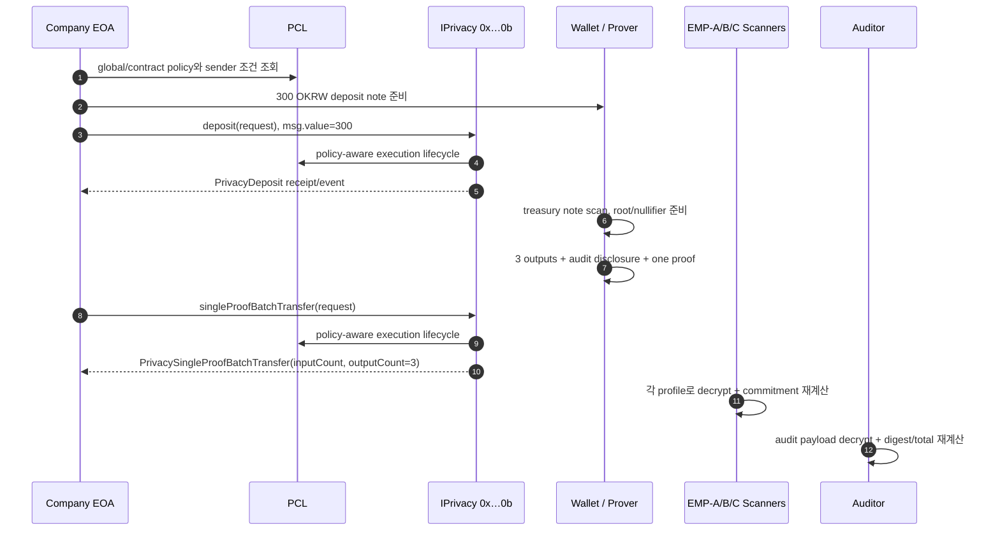

# 아키텍처 — deposit과 3-output payroll

이 워크숍은 연결·조회·지급 전체를 “한 트랜잭션”이라고 부르지 않는다. 상태 변경은 두 건이다.

1. 회사가 `deposit(request)`에 300 OKRW 상당의 `msg.value`를 붙여 treasury privacy note를 만든다.
2. 그 note를 소비하는 `singleProofBatchTransfer(request)`가 EMP-A/B/C용 output 3개를 만든다.

Maroo 외부 ABI는 Docs와 `@maroo-chain/contracts@0.0.8/precompiles/privacy/IPrivacy.sol`을 기준으로 한다. Clairveil은 privacy 구현·운영 참고이며 Maroo ABI 호환 근거가 아니다.

## 0. Maroo 정본과 구현 참고 실행

`demo/shared`는 급여 plan, prepared transaction, receipt, scan, audit evidence 계약만 소유한다. Maroo가 정본이고, Clairveil은 실제 `x/privacy`의 proof·note·scanner 경계를 참가자가 직접 확인하는 구현 참고다.

| 경로 | 책임 | evidence |
|---|---|---|
| `maroo-testnet` | Maroo public RPC doctor/preflight, bundle estimate·명시적 broadcast, receipt/event 검증 | `evidence/live-testnet/` |
| `clairveil-local` | 실제 정상 payroll·공개/직원 관찰·overspend 거부·성공한 오지급 | `evidence/local/` `[Local]` |
| offline rehearsal | chain 없이 plan·receipt·scan·audit JSON 대사와 negative control | `evidence/simulation/` `[Simulation]` |

`demo/scripts/run.ts`는 Maroo/Clairveil adapter의 `--target`을 필수로 받고 선택한 adapter 한 개만 호출한다. Maroo 오류를 잡아 Clairveil을 실행하는 자동 fallback은 없고 runtime과 성공 주장을 합치지 않는다.

제출용 `attempt` action은 또 다른 실행 target이 아니라 `maroo-testnet` adapter의 명시적 broadcast 경계다. `privacy-bundle`은 검증된 deposit bundle만 받는다. `privacy-deposit-transfer-probes`는 ABI-valid하지만 무효인 ZK 입력으로 실제 IPrivacy deposit/transfer 거부 경로를 관찰하며, 유효 proof·Privacy/PCL/payroll 성공 상태로 전이시키지 않는다.

### 0.1 개발 도구 경계

워크숍은 1인 1환경의 재현성을 위해 Bun·Go·Git과 Foundry `anvil`·`cast`·`forge` 설치를 시작 단계에서 확인한다. 이는 별도 EVM 기초 교육이나 범용 local EVM 상태 전이 실습이 아니다. 실제 상태 전이 실습은 Clairveil `x/privacy` localnet에서 하고, Maroo 구간에서는 `cast`를 public state·receipt 교차 확인에 사용한다. `check-workshop-environment.ts`는 도구와 고정 source만 검사하며 secret을 읽거나 node를 시작하지 않는다.

## 1. 상태 전이



`IPrivacy`의 policy-aware wrapper는 입력 준비, 실행 전 정책 평가, 실행, 실행 후 평가·기록의 생명주기를 가진다([Privacy policy-aware precompile](https://docs.maroo.io/concepts/privacy/privacy-policy-aware-precompile)) `[Docs Only]`. 전역 정책은 EVM 실행 전에도 평가될 수 있으므로([PCL policy enforcement](https://docs.maroo.io/concepts/compliance/pcl-policy-enforcement)) 거부의 첫 계층을 raw revert data로 구분해야 한다.

## 2. 온체인 계약

| 호출 | 자산/상태 | 공개 관측 | 워크숍 판정 |
|---|---|---|---|
| `deposit((bytes,bytes,bytes))` | `msg.value`가 privacy escrow/note로 전환 | sender/operator, amount, note commitment event | status `0x1`, exact calldata/value, `PrivacyDeposit` |
| `singleProofBatchTransfer(...)` | treasury note nullifier 소비, output commitments 3개 | root, input/output count, request hash event | status `0x1`, exact calldata, outputCount 3 |

Docs는 deposit request를 `noteCommitment`, `encryptedNote`, `proof`로 정의하고 amount를 `msg.value`에서 취한다([Privacy deposit](https://docs.maroo.io/apis/contract/contract-privacy-deposit)) `[Docs Only]`.

batch request는 다음 필드를 가진다([single-proof batch transfer](https://docs.maroo.io/apis/contract/contract-privacy-single-proof-batch-transfer)) `[Docs Only]`.

- proof, root, nullifiers.
- 여러 `PrivacySingleProofBatchTransferOutput`.
- audit key ID/epoch와 audit target public key.
- `expiresAtUnix`.

워크숍은 하나 이상의 input과 정확히 3개의 active output을 요구한다. EMP-A/B/C의 amount/profile 바인딩은 off-chain plan과 scanner report로 대사한다. event의 output count만으로 수신자를 식별하지 않는다.

## 3. PCL이 실제로 개입했다고 말하는 조건

| 확인 | 이유 |
|---|---|
| 실행 직전 global/contract policy raw state | 어떤 정책이 적용됐는지 시점 고정 |
| principal과 company sender 일치 | 다른 계정의 attestation을 근거로 삼지 않음 |
| typed PCL reason vs `Error(string)` 분리 | Privacy 입력 실패를 정책 거부로 오인하지 않음 |
| success receipt + policy 전제 + Privacy event | 단순 read를 enforcement 성공으로 부르지 않음 |

PCL custom error 예시는 [testnet reference](testnet-reference.md#pcl-reasons)에 있고, 실제 체인에 적용된 template은 preflight 결과로만 말한다. PCL lifecycle을 통과했다는 사실은 조직의 employee ID와 shielded output이 올바르게 연결됐다는 뜻이 아니다.

### 3.1 실패 계층과 주소 착오 통제

| 결과 | 판정 | 책임 |
|---|---|---|
| `300` note로 `301` output 준비가 실패하고 tx hash 없음 | Privacy client/resource rejection | wallet/prover preflight; 제출됐다면 Privacy proof 가치 보존 |
| PCL typed selector로 revert | policy rejection | 활성 PCL policy와 EAS/denylist principal 수정 |
| valid proof tx 성공, EMP-B scan 0, EMP-C scan 1 | business-intent failure | approved address registry + plan/output binding + post-receipt reconciliation |

Maroo `PrivacyTransferRequest`와 `PrivacySingleProofBatchTransferOutput`에는 공개 직원 EVM `recipient` 필드가 없다. 수취인은 proof·commitment·ciphertext가 결속하는 shielded profile이며, 숨겨진 transfer 금액은 PCL operation에서 `value=0`으로 모델링된다. 따라서 standard volume policy나 PCL 실행 자체를 employee-address 매핑 검증으로 사용하지 않는다. 별도 recipient identity 정책을 도입했다면 그 정책 설정과 typed rejection을 evidence로 남겨야 한다.

## 4. 오프체인 신뢰 경계

| 구성요소 | 보는 민감 데이터 | 반드시 검증할 것 |
|---|---|---|
| company wallet | spending key, treasury note, recipient profiles | chain/domain, approved payroll plan digest, address-registry version, root, nullifier, intent expiry |
| prover | circuit에 따라 전체 witness와 직원별 amount/address | Maroo VK/circuit 호환, approved plan/output binding, artifact provenance, 로그·보존 정책 |
| employee scanner | 해당 profile의 viewing material와 decrypt note | cursor, view tag fallback, commitment 재계산, 중복 제거 |
| auditor | audit private key와 disclosure plaintext | key ID/epoch, digest, total, 승인·접근 로그 |
| evidence collector | 공개 bundle digest, receipt, redacted reports | plan/employee/address digest/output/tx/commitment 바인딩, secret 미포함 |

remote prover를 사용하면 TLS/token만의 문제가 아니다. witness가 서비스 경계를 넘는지, 저장/로그/운영자가 볼 수 있는지를 조직이 결정해야 한다. 이 저장소의 JSON contract는 데이터 연결을 검증할 뿐 prover와 scanner의 정직성을 대신하지 않는다.

## 5. 가시성

| 주체 | 알 수 있는 것 | 알 수 없어야 하는 것 |
|---|---|---|
| 일반 explorer 사용자 | company address, deposit 총액, tx/event metadata, batch shape | 직원 identity↔output, 직원별 amount plaintext |
| EMP-A/B/C | 자기 viewing profile로 복구한 note | 다른 직원의 plaintext |
| auditor | 승인된 audit disclosure 범위의 직원·금액·총액 | 범위 밖의 wallet secret |
| PCL operator/admin | policy configuration와 평가 입력 | note plaintext 전체가 자동 공개되는 것은 아님 |

deposit amount가 공개되는 것과 이후 직원별 배분이 private인 것은 모순이 아니다. 조직은 총액 노출도 감출 필요가 있는지 별도 요구사항으로 결정해야 한다.

## 6. 완료 상태 모델

```text
Prepared
  → DepositConfirmed
  → PayrollConfirmed
  → EmployeeDeliveryConfirmed (3/3)
  → AuditVerified
```

- `DepositConfirmed`: 300 value와 `PrivacyDeposit` 확인.
- `PayrollConfirmed`: batch receipt와 `outputCount=3` 확인.
- `EmployeeDeliveryConfirmed`: 세 별도 scanner가 각 commitment를 소유한 것으로 재검증.
- `AuditVerified`: audit digest, total, key epoch 검증.

중간 상태를 건너뛰지 않는다. `PayrollConfirmed`인데 EMP-C scan이 실패한 경우 tx를 재전송하지 않고 delivery reconciliation을 수행한다.

## 7. Clairveil 구현 참고 검증과의 차이

| 항목 | 목표 Maroo live | Clairveil 참고 검증 |
|---|---|---|
| asset/runtime | OKRW + EVM | `uclair` + Cosmos SDK localnet |
| compliance | PCL global/contract policy | PCL 없음 |
| batch | `singleProofBatchTransfer`, one proof, 3 output | `BatchJoinSplit16x32`, one proof, 3 output |
| recipients | EMP-A/B/C 별도 Maroo-compatible profile | EMP-A/B/C 별도 Clairveil local profile |
| evidence | two receipts + 3 scans + audit | local receipts + public/employee observation + scans 3개 + overspend/misdirection controls |

Clairveil 실행은 75분 안에서 실제 `x/privacy` chain/proof/scan 운영 흐름을 직접 익히게 하지만 목표 Maroo 경로의 등가 구현은 아니다.

## 8. 프로덕션 전 결정

1. prover 위치, witness 노출, VK/artifact 배포·회전 owner.
2. PCL sender/recipient policy와 attestation 발급·revoke SLA.
3. employee↔shielded-address registry의 승인·회전·폐기와 payroll plan digest 결속.
4. employee viewing key 복구, 퇴사, 재스캔 정책.
5. audit key HSM/KMS, epoch 회전, 열람 승인과 보존 기간.
6. tx confirmed와 employee delivery를 분리한 idempotency/reconciliation 상태기계.
7. 실제 규모에서 proof time, memory, gas, block limit, deadline SLA.
