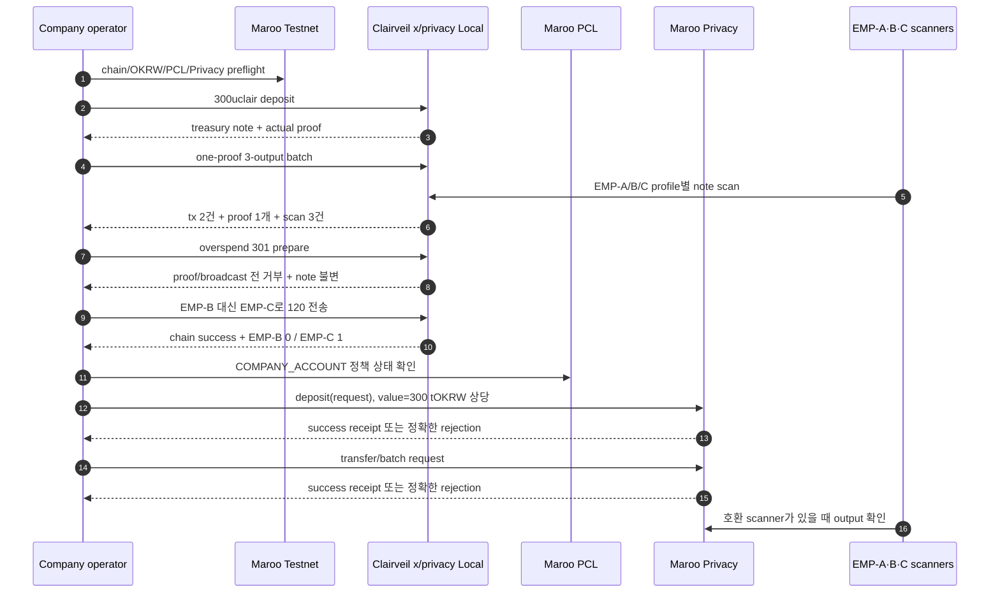

# 커리큘럼 — Maroo Testnet Confidential Payroll (Track B)

이 워크숍은 한국 금융기관의 시니어 백엔드·블록체인 엔지니어가 75분 안에 **Maroo Testnet을 중심으로** OKRW·PCL·Privacy의 연결을 실행하고 판정하도록 설계한다. 참가자는 1인 1환경으로 진행하며 회사 자금관리자와 직원 확인자의 역할을 혼자 순서대로 수행한다.

Maroo Developer Relations 과제에서 Maroo Docs는 테스트넷 주소·ABI·외부 호출 방식의 정본이고, Clairveil은 `x/privacy` 구현 구조·prover·scanner·disclosure의 참고 자료다. **Maroo Testnet이 항상 우선**이며, Clairveil Local은 Maroo 실행 사이에 실제 proof와 note 흐름을 이해하기 위해 참가자가 직접 수행하는 구현 참고 실습이다.

## 0. 워크숍에서 증명할 한 문장

> 회사가 공개된 300 tOKRW 상당을 Privacy에 예치하고, 하나의 3-output 요청으로 EMP-A·B·C의 비공개 note를 만들며, PCL 판정·receipt·직원 scan·disclosure의 책임 경계를 설명한다.

호환 prover가 없는 현재 제출 환경에서는 이 문장의 **Maroo 성공 전체**를 주장하지 않는다. 참가자는 먼저 Maroo Testnet 연결·OKRW·PCL·Privacy 상태를 확인하고, Clairveil Local에서 실제 `x/privacy` deposit→one-proof batch→직원별 scan을 성공시킨다. 이어 `301uclair` overspend 거부와 EMP-B 대신 EMP-C에게 `120uclair`를 보내는 성공한 오지급을 비교한 뒤, Maroo Testnet에서 Privacy deposit→transfer를 실제 시도해 성공 또는 거부의 첫 실패 계층을 증거로 남긴다.

### 증거 라벨

| 라벨 | 이 워크숍에서의 의미 |
|---|---|
| `[Live Testnet]` | Maroo Testnet RPC 조회·estimate·broadcast·receipt. 상태 변경 여부는 evidence에 별도 기록 |
| `[Local]` | Clairveil `x/privacy` localnet의 실제 transaction·proof·EMP-A/B/C scan. 구현 참고이며 Maroo 호환 증거는 아님 |
| `[Simulation]` | 결정적 JSON fixture로 수행하는 offline 대사·negative control. chain·proof·decrypt 없음 |
| `[Docs Only]` | Maroo Docs·ABI·Clairveil source에서만 확인한 사실 |

## 1. 페르소나

| 항목 | 가정 |
|---|---|
| 조직 | 한국 은행·핀테크·결제·커스터디 또는 기업 자금관리 조직 |
| 역할 | 월 급여 배치·승인·정산·장애 대응을 맡는 시니어 엔지니어 또는 테크니컬 리드 |
| 익숙한 기술 | EVM, Solidity 연동, TypeScript, JSON-RPC, Foundry |
| 처음 접하는 기술 | Maroo, `x/privacy`, note/nullifier, prover/VK, viewing key, disclosure |
| 의사결정 | 4~8주 안에 기관 PoC의 범위와 go/no-go 조건 제안 |
| 판단 기준 | ABI, 상태 전이, 데이터 가시성, 키 custody, 실패 모드, 감사 가능성 |

참가자는 EVM 개발 도구 사용법이나 새 ZK 회로를 배우지 않는다. 다만 1인 1환경의 재현성을 위해 수업 초반에 Bun·Go·Git·Foundry 전체 설치와 Clairveil source version을 함께 확인한다. **누가 proof를 만들고, 어느 시스템이 무엇을 검증하며, 무엇이 공개되고, 실패를 어디서 판정하는지**를 실제 실행으로 배운다.

## 2. 시나리오와 역할

### 2.1 Maroo 급여 배치

| 대상 | 금액 | 공개 목표 | 실행 역할 |
|---|---:|---|---|
| EMP-A | 100 | 직원·승인된 감사자만 | 첫 번째 privacy output |
| EMP-B | 120 | 직원·승인된 감사자만 | 두 번째 privacy output |
| EMP-C | 80 | 직원·승인된 감사자만 | 세 번째 privacy output |
| 합계 | 300 | deposit 단계에서 회사·총액이 공개될 수 있음 | 회사 treasury note |

- `COMPANY_ACCOUNT` / `COMPANY_PRIVATE_KEY`: 회사 자금관리자. Maroo deposit과 payroll transaction을 서명한다.
- `EMPLOYEE_ACCOUNT`: 회사 signer와 다른 공개 직원 계정. 역할 분리와 정책 판정에 사용한다.
- EMP-A·B·C shielded profile: 직원별 note scan에 쓰는 privacy material. 공개 EVM 주소와 같은 개념이 아니다.
- Clairveil 참고 실습도 같은 명목 급여표를 사용해 EMP-A/B/C에 `100/120/80uclair`, 총 `300uclair`를 지급한다. 배분은 맞추되 `uclair`를 tOKRW로 해석하지 않는다.

### 2.2 통제 사례 두 개

| 통제 | Clairveil Local에서 관찰할 결과 | 첫 판정 계층 | Maroo에서의 해결 책임 |
|---|---|---|---|
| 예치 note `300`으로 합계 `301` 지급 시도 | 입력 선택 단계에서 거부, proof·broadcast 없음, treasury note 불변 | Privacy client/resource invariant | prover 전 available-note preflight + Privacy 가치 보존 검증. private transfer 금액 한도는 PCL이 자동으로 처리한다고 주장하지 않음 |
| EMP-B용 `120`을 유효한 EMP-C shielded address로 지정 | transaction `code=0`, EMP-B 신규 note 0, EMP-C 신규 note 1 | business-intent failure | 승인된 employee↔shielded-address registry, 승인된 plan digest와 prover output 결속, 제출 전 fail-closed 검증, 제출 후 employee scan 대사 |

두 번째 사례의 EMP-C는 형식도 유효하고 정책상 허용될 수 있는 합성 직원이다. 따라서 “PCL이 통과했으니 급여 대상도 맞다”는 결론은 성립하지 않는다. PCL은 활성화된 sender/recipient·EAS·denylist 정책을 집행하지만, 조직의 EMP-B↔shielded-address 매핑을 별도로 등록·결속하지 않았다면 인사 원장의 의도를 알 수 없다. Clairveil Local에는 Maroo PCL 자체가 없으므로 이 사례를 PCL rejection이라고 부르지 않는다.

### 2.3 실행과 상태 전이



Clairveil 성공과 Maroo 결과를 한 성공 경로로 합치지 않는다. Clairveil은 실제 `x/privacy` proof와 scanner 동작을 이해하는 구현 참고이고, Maroo receipt만 `[Live Testnet]` 증거다.

## 3. 학습 목표와 성과

| ID | 학습 목표 | 관찰 가능한 성과 | 통과 기준 |
|---|---|---|---|
| **O1** | OKRW·PCL·Privacy의 역할을 연결한다 | 자기 말로 상태 전이를 설명 | native value, policy principal, note/nullifier를 모두 언급 |
| **O2** | 실제 `x/privacy` 상태 전이와 가치 보존 실패를 실행한다 | Clairveil Local evidence | 정상 deposit·batch `code=0`; `300→301`은 proof·broadcast 전 거부되고 treasury note 불변 |
| **O3** | 공개 receipt, 직원 수신, 업무 의도를 분리해 검증한다 | 공개 event·EMP-A/B/C scan·오지급 control | 정상 지급은 scan 3개, 오지급은 tx 성공과 EMP-B 0/EMP-C 1을 함께 확인 |
| **O4** | Maroo 준비 상태를 판정한다 | preflight JSON | chain `450815`, 회사 잔액, OKRW params, PCL/Privacy 응답과 UTC가 있음 |
| **O5** | Maroo Privacy 호출을 제출하고 판정한다 | 성공 receipt 또는 실패 evidence | 성공이면 tx/event/scan, 실패면 tx hash·status·오류·UTC·환경·재현 명령 |
| **O6** | 구현·운영 경계를 설명한다 | exit ticket | Privacy 거부·PCL 거부·업무 실패를 구분하고 prover/VK·PCL·address registry·scanner·custody owner를 지정 |

## 4. 사전 요구 사항과 준비 상태

### 4.1 참가자 환경

- macOS, Bun 1.4+, TypeScript 7, Git, Go 1.25 계열.
- Foundry 도구 모음 `anvil`, `cast`, `forge`. 수업에서는 `cast`를 Maroo 공개 상태·receipt 확인에 사용하고, `anvil`·`forge`는 설치 일관성을 확인한다.
- repository와 같은 상위 폴더의 `../clairveil`, commit `ca85b02708fdd75259d4d2ee2d671c21198cec69`.
- Maroo 테스트넷 전용 회사 계정·개인키와 별도 직원 공개 계정.
- 300 tOKRW 상당 + 두 transaction gas + 재시도 여유.
- 호환 prover/scanner bundle이 있다면 adapter version·commit·VK 식별자.
- 실제 직원 정보·운영 지갑·운영 키는 사용하지 않는다.

### 4.2 사전 설치와 수업 중 readiness

도구 설치와 repository·Clairveil clone은 사전 준비다. 수업의 **07–17분**에는 아래 명령을 전원이 함께 실행해 같은 시작선을 확인하고, 실패자는 진행자의 setup 지원 경로로 이동한다. 범용 Anvil chain을 띄우거나 Solidity 기초를 다시 실습하지 않는다.

```bash
bun --version
go version
anvil --version
cast --version
forge --version
git -C ../clairveil rev-parse HEAD
bun install --cwd demo --frozen-lockfile
bun run demo/scripts/check-workshop-environment.ts
bun run --cwd demo typecheck
test -f demo/.env || cp demo/.env.example demo/.env
```

`WORKSHOP ENVIRONMENT READY`가 출력되면 Bun 1.4+, Go, Git, Foundry 전체와 지정 Clairveil SHA가 준비된 것이다. 이 검사는 secret을 읽거나 chain 상태를 바꾸지 않는다. `demo/.env`에는 `COMPANY_ACCOUNT`, `COMPANY_PRIVATE_KEY`, `EMPLOYEE_ACCOUNT`를 서로 맞게 넣는다. 회사 private key는 employee 계정의 키가 아니다.

```bash
bun run demo/scripts/run.ts --target maroo-testnet --action doctor \
  --env demo/.env --out evidence/live-testnet/doctor.json
bun run demo/scripts/run.ts --target maroo-testnet --action preflight \
  --env demo/.env --out evidence/live-testnet/preflight.json
```

전체 준비 통과 기준은 `WORKSHOP ENVIRONMENT READY`, `MAROO TESTNET DOCTOR PASSED: chain 450815`, preflight의 `checks.funding="deposit-minimum-pass"`다. Clairveil의 Go dependency와 ZK artifact 생성 비용은 전날 한 번 실행해 cache를 예열한다.

## 5. Maroo 우선 75분 진행안

<!-- workshop-agenda:start -->
| 시간 | 단계 | 참가자 행동 | success criteria | 성과 |
|---|---|---|---|---|
| **00–07** | Maroo 목표·역할 | 급여표와 공개/비공개 가설, company/employee 역할을 적는다 | OKRW·PCL·Privacy를 한 상태 흐름으로 설명 | O1 |
| **07–17** | 공통 환경 setup | 의존성 설치, Bun·Go·Git·Foundry·Clairveil SHA와 `.env` 역할 확인 | `WORKSHOP ENVIRONMENT READY`, typecheck 통과, 계정 역할 분리 | O6 |
| **17–27** | Maroo readiness | doctor·preflight와 공개 상태 교차 확인 | chain 450815, 잔액·정책·주소 evidence | O4 |
| **27–44** | Clairveil 정상·관찰·실패 실습 | actual payroll, 공개/직원 관찰 비교, overspend 거부, 유효 주소 오지급 실행 | 정상 scan 3; `301` 무상태 거부; 오지급 tx 성공·EMP-B 0/EMP-C 1 | O2·O3 |
| **44–52** | Maroo 대응 관계·통제 설계 | local 결과를 Maroo ABI/VK/PCL과 매핑하고 EMP-B→EMP-C profile 오결속의 제출 전 거부를 실행 | adapter control marker, PCL/app-prover 경계, Path A/B·target·성공 주장 범위 확인 | O1·O6 |
| **52–63** | Maroo deposit→transfer | 회사 signer로 선택한 두 호출을 순서대로 제출한다 | 성공 receipt 또는 두 tx hash·rejection evidence | O5 |
| **63–69** | receipt·직원 확인·실패 경계 | explorer receipt, scan 가능 여부와 첫 실패 계층을 판정 | receipt/delivery 분리, evidence label과 미검증 항목 기록 | O3·O5·O6 |
| **69–75** | 종료·다음 단계 | exit ticket과 evidence index, 4~8주 owner를 작성 | O1~O6 체크와 비밀정보 검사 완료 | O1~O6 |
<!-- workshop-agenda:end -->

실행 명령의 정본은 [참가자 가이드](participant-guide.md), 운영 판단은 [진행자 가이드](facilitator-guide.md), 오류 복구는 [Troubleshooting](troubleshooting.md)을 따른다.

## 6. 구간별 토론 질문

1. **00–07:** deposit 총액 공개와 직원별 지급액 비공개는 동시에 성립할 수 있는가?
2. **07–17:** 모든 도구 버전은 맞지만 company key/address가 다르면 환경 준비가 끝난 것인가?
3. **17–27:** PCL이 검사하는 principal이 회사 signer라는 근거는 무엇인가?
4. **27–44:** 왜 overspend는 거부되지만 유효한 EMP-C 주소로 보낸 오지급은 chain에서 성공하는가?
5. **44–52:** Maroo PCL 통과와 EMP-B 수취인 매핑 검증은 왜 같은 보장이 아니며, 어느 계층이 각각 책임져야 하는가?
6. **52–63:** deposit proof를 만드는 주체와 transaction gas를 내는 주체는 같은가?
7. **63–69:** batch receipt 성공과 직원 수신은 왜 별도이며, PCL/Privacy 실패는 어떤 data로 구분하는가?
8. **69–75:** 우리 조직에서 prover, viewing key, audit key를 각각 누가 운영해야 하는가?

## 7. 진행 중 경로 선택과 대체 진행

Maroo Testnet이 항상 우선이다.

| 조건 | 참가자 실행 | 판정 |
|---|---|---|
| 호환 Maroo deposit·batch bundle과 scanner 준비 | `privacy-bundle` 경로로 deposit→batch→EMP-A/B/C scan | 성공 또는 정확한 rejection을 `[Live Testnet]`으로 기록 |
| 호환 Maroo prover/scanner 미확보 | 실제 Privacy deposit·transfer rejection probe 제출 | 두 실패 tx를 live attempt로 기록하고 성공 주장 금지 |
| Clairveil local 실행 성공 | proof·note·nullifier·scanner evidence를 분석 | `[Local]` 구현 참고로만 기록; Maroo 성공 대체 금지 |
| Clairveil local 장애 | 저장된 local evidence로 구조 판정 후 Maroo 구간 계속 | 참가자 local 실행 미완료를 exit ticket에 표시 |
| Maroo RPC 일시 장애 | 저장된 live receipt를 판독하고 local evidence와 차이 분석 | 당일 live 미실행을 명시; `[Local]`로 대체 주장 금지 |

## 8. 종료 후 다음 단계 — 4~8주 PoC

| 기간 | 결정할 것 | 산출물 | owner |
|---|---|---|---|
| 1주차 | Clairveil 참고 결과와 Maroo 호환 bundle 생성 경로의 차이 | prover/VK/scanner compatibility matrix | 플랫폼·암호팀 |
| 2주차 | 회사·직원 PCL/EAS 자격과 수취인 등록 | principal/attestation/policy matrix + employee↔shielded-address registry 계약 | 컴플라이언스·개발 |
| 3주차 | viewing/audit key custody | KMS/HSM, 회전, 복구, 열람 승인안 | 보안·감사 |
| 4주차 | 3~10명 테스트넷 payroll | deposit·batch·scan·rejection evidence | 개발·운영 |
| 5~6주차 | 재시도·대사·부분 실패 | idempotency, nullifier/root refresh, reconciliation runbook | 운영·개발 |
| 7~8주차 | 파일럿 진입 판정 | 성능·가스·SLA·미결정 owner와 go/no-go | 전 팀 |

프로덕션 전에는 remote prover의 witness 가시성, VK 배포·회전, scanner 복구, audit disclosure 보존, PCL 정책 변경 권한, 승인된 payroll plan digest와 shielded output 결속, 성공 receipt 이후 직원 미탐색 처리까지 닫아야 한다.

## 9. 범위 밖

- 새 ZK 회로 또는 Maroo·Clairveil 핵심 프로토콜 수정.
- Clairveil `uclair` 결과를 Maroo OKRW·PCL·ABI/VK 성공으로 표현하는 것.
- 호환성이 확인되지 않은 Clairveil proof를 Maroo에 제출하는 것.
- 실제 직원 데이터·실제 급여·운영 키 사용.
- 법률 자문 또는 규제 적합성 보증.
